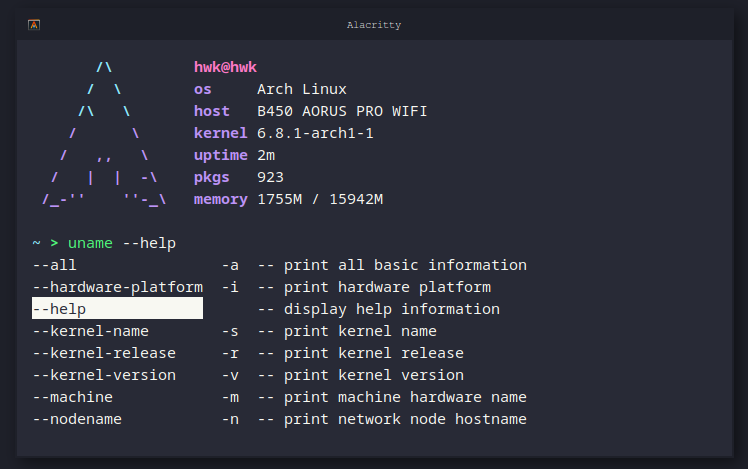

# Personal Shell Configuration

 

<hr />

<p align="center">
    
</p>


Configuration files for my shells. I try to keep `bash` as simple as possible while using `zsh` as my main shell.

- `/sources` is for things like `export` or `alias`.
- `/scripts` is for things that can run such as functions.
- `/home` is where all the configuration files are located (such as `.bashrc`).

## Setup

I'm only using `bash` and `zsh` at the moment. All of my `zsh` plugins are managed as Arch packages. The full list of plugins and versions I'm running can be found in [/.list](.list).

```sh
$ cd ~/.config
$ git clone https://github.com/Cyan903/shell.git
$ ./shell/home/link
```

## License

[MIT](LICENSE)
