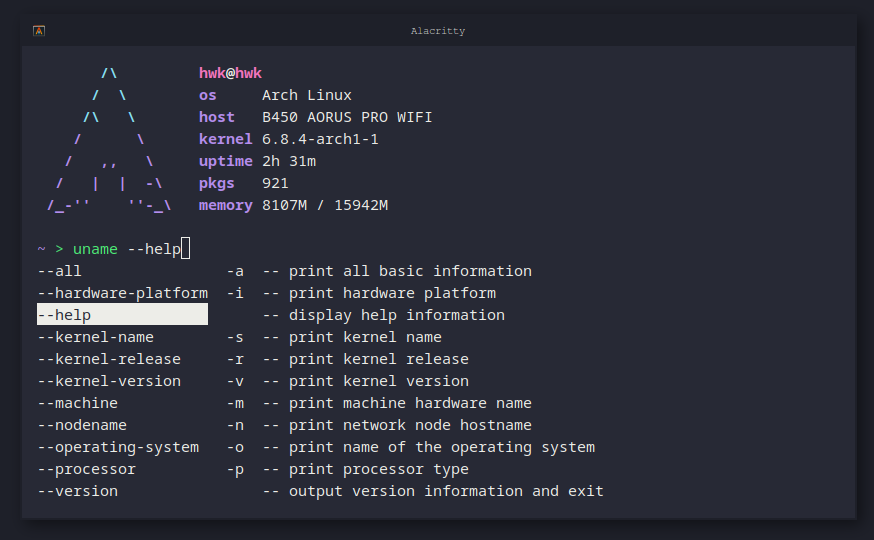

# Shell Configuration

 

<hr />

<p align="center">
    
</p>

<hr />

Configuration files for my shells. I try to keep `bash` as simple as possible while using `zsh` as my main shell.

- `/home` is where all the configuration files are located (such as `.bashrc`).
- `/prompt` is a custom prompt for `bash` and `zsh`.
- `/config` is a shared config between shells (sources, scripts, etc...)
  - `/scripts` is for things that can run such as functions.
  - `/sources` is for things like `export` or `alias`.

## Setup

I'm only using `bash` and `zsh` at the moment. All of my `zsh` plugins are managed with [zap](https://github.com/zap-zsh/zap).

```sh
$ cd ~/.config
$ git clone https://github.com/Cyan903/shell.git
$ ./shell/home/link
```

## License

[MIT](LICENSE)
